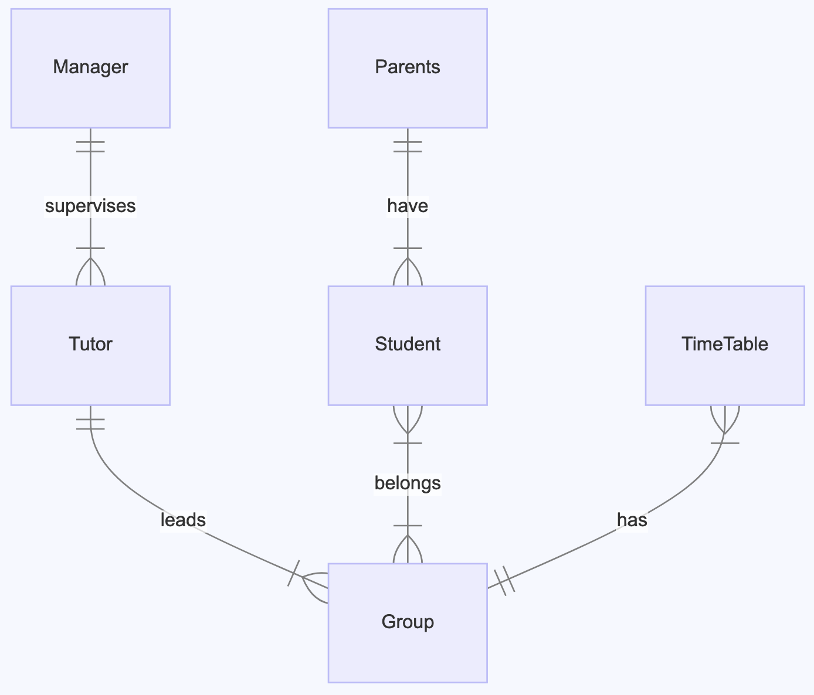

### Purpose
    The purpose of this database is to store information in the coding schools. It should hold information about the students that signed for the course,
    the tutors that teach them, groups they belong to, managers that manage the tutors and parents of the student. The school teaches children.
    
    The ER Diagram is as follows:
    

### Scope
The database is intended to be used by tutoring organizations to manage their operations. It can be used to track which tutor is teaching which study group, which students are in which study groups, which manager is responsible for which tutor, and when each study group meets. The database is designed to be flexible and scalable, capable of supporting a wide range of tutoring operations, from small tutoring centers to large educational institutions. It provides a comprehensive view of the tutoring operations, facilitating effective decision-making and strategic planning.

### Entities
The database consists of seven entities:

manager: Represents a manager in the tutoring organization. Each manager has a unique id, name, surname, and birthdate. The manager is a key figure in the tutoring organization, responsible for overseeing the tutors and ensuring the smooth operation of the tutoring sessions.

tutor: Represents a tutor in the tutoring organization. Each tutor has a unique id, name, surname, birthdate, and a manager_id that links them to a manager. The tutor is an essential part of the tutoring system, providing instruction to the students and facilitating their learning process.

study_group: Represents a study group. Each study group has a unique id, name, creation_date, start_date, end_date, and programming_language. The study group is where the tutoring sessions take place, bringing together tutors and students in a conducive learning environment.

student: Represents a student. Each student has a unique id, name, surname, birthdate, and a parent_id that links them to a parent. The student is the primary beneficiary of the tutoring system, receiving instruction and guidance from the tutors.

parent: Represents a parent of a student. Each parent has a unique id, name, surname, and birthdate. The parent plays a supportive role in the tutoring system, providing encouragement and support to the student.

belongs2group: Represents the relationship between study_group, student, and tutor. Each record in this table represents a student and a tutor belonging to a study group. This table is crucial for organizing the tutoring sessions, ensuring that each student is assigned to a study group and each study group has a tutor.

timetable: Represents the schedule for each study group. Each record in this table represents a time slot for a study group. The timetable is an important tool for managing the tutoring sessions, ensuring that each study group meets at a scheduled time and avoiding conflicts in scheduling.

### Relationships
The relationships between the entities are as follows:

A manager can manage multiple tutors, but each tutor is managed by only one manager. This relationship ensures that each tutor has a manager who oversees their work and provides guidance and support.

A tutor can teach multiple study groups, and a study group can be taught by multiple tutors. This relationship allows for flexibility in assigning tutors to study groups, ensuring that each study group has a tutor and each tutor has a study group to teach.

A student can belong to multiple study groups, and a study group can have multiple students. This relationship facilitates the organization of the study groups, ensuring that each student is assigned to a study group and each study group has students.

A parent can have multiple students, but each student has only one parent. This relationship links each student to a parent, providing a point of contact for communication and support.

A study group can have multiple time slots in the timetable, but each time slot in the timetable belongs to only one study group. This relationship ensures that each study group has a schedule and each time slot in the schedule is assigned to a study group.

### Optimizations
The database is normalized to reduce data redundancy and improve data integrity. The use of foreign keys ensures referential integrity. Indexes can be added on the foreign keys to improve query performance. The database is designed to be efficient and performant, capable of handling large volumes of data and supporting complex queries.

### Limitations
The database does not enforce business rules. For example, it does not prevent a student from being enrolled in two study groups that meet at the same time. This limitation requires additional logic in the application layer to enforce these rules.

The database does not store historical data. For example, it does not keep track of past study groups a student was enrolled in. This limitation can be addressed by extending the database schema to include historical data.

The database does not handle complex scheduling. For example, it does not prevent scheduling a study group at two different times on the same day. This limitation requires additional logic in the application layer to handle complex scheduling scenarios.

The database does not store contact information for managers, tutors, students, or parents. This information would be needed for communication purposes. This limitation can be addressed by extending the database schema to include contact information.